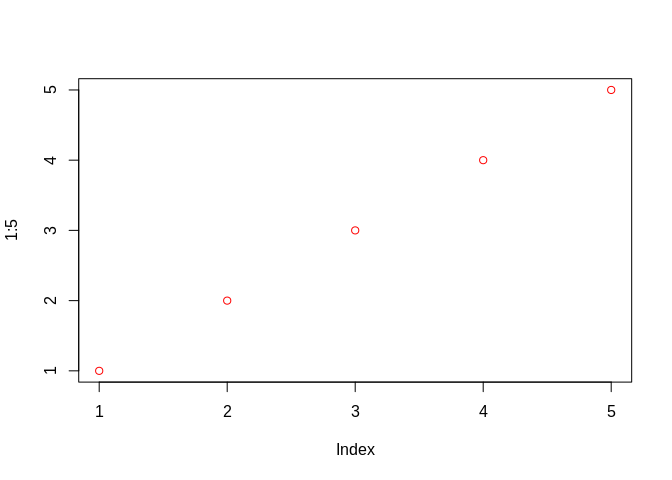
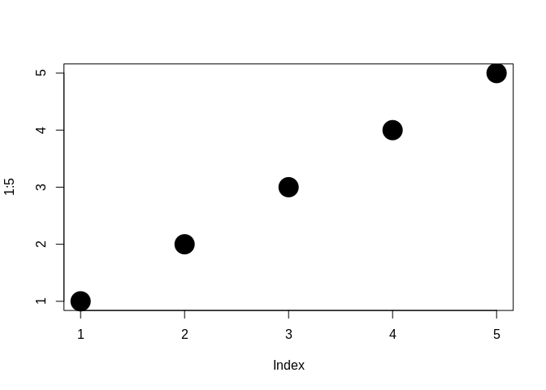
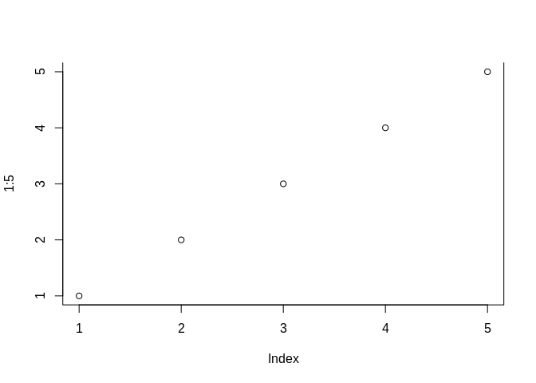

Advanced\_R(chap\_5\_style\_guide)
================
jakinpilla
2019-02-11

-   [Functions](#functions)
    -   [Function components](#function-components)
        -   [Primitive functions](#primitive-functions)
    -   [Lexical scoping](#lexical-scoping)
        -   [Name masking](#name-masking)
        -   [Functions vs variables](#functions-vs-variables)
        -   [A fresh start](#a-fresh-start)
        -   [Dynamic lookup](#dynamic-lookup)
        -   [Exercise](#exercise)
    -   [Every operation is a function call](#every-operation-is-a-function-call)
    -   [Function arguments](#function-arguments)
        -   [Calling functions](#calling-functions)
        -   [Default and missing arguments](#default-and-missing-arguments)
        -   [Lazy evaluation](#lazy-evaluation)
    -   [`...`](#section)
        -   [Exercise](#exercise-1)

### Functions

#### Function components

``` r
f <- function(x) x^2
f
```

    ## function(x) x^2

``` r
formals(f)
```

    ## $x

``` r
body(f)
```

    ## x^2

``` r
environment(f)
```

    ## <environment: R_GlobalEnv>

##### Primitive functions

``` r
sum
```

    ## function (..., na.rm = FALSE)  .Primitive("sum")

``` r
formals(sum)
```

    ## NULL

``` r
body(sum)
```

    ## NULL

``` r
environment(sum)
```

    ## NULL

1.  What function allows you to tell if an object is a function? What function allows you to tell if a funcion is a primitive function?

2.  This code makes a list of all functions in the base package/

``` r
objs <- mget(ls("package:base"), inherits = T)
funs <- Filter(is.function, objs)
```

-   Which base function has the most arguments?

-   How many base functions have no arguments? What's special about those functions?

-   How couid you adapt the code to find all primitive functions?

#### Lexical scoping

``` r
x <- 10
x
```

    ## [1] 10

##### Name masking

``` r
f <- function() {
  x <- 1
  y <- 2
  c(x, y)
}

f()
```

    ## [1] 1 2

``` r
rm(f)

x <- 2
g <- function() {
  y <- 1
  c(x, y)
}

g()
```

    ## [1] 2 1

``` r
rm(x, g)

x <- 1
h <- function() {
  y <- 2
  i <- function() {
    z <- 3
    c(x, y, z)
  }
  i()
}

h()
```

    ## [1] 1 2 3

``` r
rm(x, h)

j <- function(x) {
  y <- 2
  function() {
    c(x, y)
  }
}

k <- j(1)

k()
```

    ## [1] 1 2

``` r
rm(j, k)
```

##### Functions vs variables

``` r
l <- function(x) x + 1
m <- function() {
 l <- function(x) x * 2
 l(10)
}

m()
```

    ## [1] 20

``` r
rm(l, m)

n <- function(x) x/2
o <- function() {
  n <- 10
  n(n)
}

o()
```

    ## [1] 5

``` r
rm(n, o)
```

##### A fresh start

``` r
j <- function() {
  if(!exists("a")) {
    a <- 1
  } else {
    a <- a +1
  }
  a
}

j()
```

    ## [1] 1

``` r
rm(j)
```

##### Dynamic lookup

``` r
f <- function() x
x <- 15
f()
```

    ## [1] 15

``` r
x <- 20
f()
```

    ## [1] 20

``` r
f <- function() x + 1
codetools::findGlobals(f)
```

    ## [1] "+" "x"

``` r
# environment(f) <- emptyenv()
# f()

`(` <- function(e1) {
  if(is.numeric(e1) && runif(1) < .1) {
    e1 + 1
  } else {
    e1
  }
}

replicate(50, (1+2))
```

    ##  [1] 3 3 3 3 3 3 3 4 3 3 3 3 3 3 3 3 3 3 3 3 3 4 3 3 3 3 4 3 3 3 3 3 3 3 3
    ## [36] 3 3 3 3 3 3 3 3 3 3 3 3 3 3 3

``` r
rm("(")
```

##### Exercise

1.  What does the following code return? Why? What does each of the three c's mean?

``` r
c <- 10
c(c = c)
```

    ##  c 
    ## 10

1.  What are the four principles that govern how R looks for values?

2.  What does the following function return? Make a prediction before running the code yourself?

``` r
f <- function(x) {
  f <- function(x) {
    f <- function(x) {
      x ^ 2
    }
    f(x) + 1
  }
  f(x) + 2
}

f(10)
```

    ## [1] 103

#### Every operation is a function call

To understand computations in R, two slogans are helpful:

-   Everything that exist is an object

-   Everything that happens is a function call

``` r
x <- 10; y <- 5
x + y
```

    ## [1] 15

``` r
`+`(x, y)
```

    ## [1] 15

``` r
`for`(i, 1:2, print(i))
```

    ## [1] 1
    ## [1] 2

``` r
if (i == 1) print("yes!") else print("no.")
```

    ## [1] "no."

``` r
`if`(i == 1, print("yes!"), print("no."))
```

    ## [1] "no."

``` r
x[3]
```

    ## [1] NA

``` r
`[`(x, 3)
```

    ## [1] NA

``` r
{print(1); print(2); print(3)}
```

    ## [1] 1
    ## [1] 2
    ## [1] 3

``` r
`{`(print(1), print(2), print(3))
```

    ## [1] 1
    ## [1] 2
    ## [1] 3

``` r
add <- function(x, y) x + y
sapply(1:10, add, 3)
```

    ##  [1]  4  5  6  7  8  9 10 11 12 13

``` r
sapply(1:5, `+`, 3)
```

    ## [1] 4 5 6 7 8

``` r
sapply(1:5, "+", 3) # sapply() can be given the name of a  function instead of the function itself.
```

    ## [1] 4 5 6 7 8

``` r
x <- list(1:3, 4:9, 10:12)
sapply(x, "[", 2)
```

    ## [1]  2  5 11

``` r
sapply(x, function(x) x[2])
```

    ## [1]  2  5 11

#### Function arguments

##### Calling functions

``` r
f <- function(abcdef, bcde1, bcde2) {
  list(a = abcdef, b1 = bcde1, b2 = bcde2)
}

str(f(1, 2, 3))
```

    ## List of 3
    ##  $ a : num 1
    ##  $ b1: num 2
    ##  $ b2: num 3

``` r
str(f(2, 3, abcdef = 1))
```

    ## List of 3
    ##  $ a : num 1
    ##  $ b1: num 2
    ##  $ b2: num 3

``` r
# Can abbreviate long argument names:
str(f(2, 3, a =1))
```

    ## List of 3
    ##  $ a : num 1
    ##  $ b1: num 2
    ##  $ b2: num 3

``` r
# But this doesn't work because abbreviation is ambiguous
# str(f(1, 3, b = 1))

mean(1:10)
```

    ## [1] 5.5

``` r
mean(1:10, trim = 0.05)
```

    ## [1] 5.5

``` r
mean(x = 1:10) # this is probably overkill
```

    ## [1] 5.5

``` r
mean(1:10, n = T)
```

    ## [1] 5.5

``` r
mean(1:10, , FALSE)
```

    ## [1] 5.5

``` r
mean(1:10, 0.05)
```

    ## [1] 5.5

``` r
mean(, TRUE, x = c(1:10, NA))
```

    ## [1] 5.5

``` r
args <- list(1:10, na.rm = T)
```

How could you then send that list to mean()? You need \`do.call()\`\`

``` r
do.call(mean, args)
```

    ## [1] 5.5

##### Default and missing arguments

``` r
f <- function(a =1, b = 2) {
  c(a, b)
}

f()
```

    ## [1] 1 2

``` r
g <- function(a = 1, b = a * 2) {
  c(a, b)
}

g()
```

    ## [1] 1 2

``` r
h <- function(a = 1, b = d) {
  d <- (a+1)^2
  c(a, b)
}

h()
```

    ## [1] 1 4

``` r
h(10)
```

    ## [1]  10 121

``` r
i <- function(a, b) {
  c(missing(a), missing(b))
}

i()
```

    ## [1] TRUE TRUE

``` r
i(a=1)
```

    ## [1] FALSE  TRUE

``` r
i(b=2)
```

    ## [1]  TRUE FALSE

``` r
i(1, 2)
```

    ## [1] FALSE FALSE

##### Lazy evaluation

``` r
f <- function(x) {
  10
}

f(stop("This is an error!"))
```

    ## [1] 10

If you want to ensure that an argument is evaluated you can use `force()`

``` r
f <- function(x) {
  force(x)
  10
} 

# f(stop("This is an error!"))

add <- function(x) {
  function(y) x+y
}

adders <- lapply(1:10, add)
adders[[1]](10)
```

    ## [1] 11

``` r
adders[[10]](10)
```

    ## [1] 20

``` r
add <- function(x) {
  x
  function(y) x + y
}

f <- function(x  = ls()) {
  a <- 1
  x
}

f()
```

    ## [1] "a" "x"

``` r
f(ls())
```

    ##  [1] "add"    "adders" "args"   "c"      "f"      "funs"   "g"     
    ##  [8] "h"      "i"      "objs"   "x"      "y"

``` r
x <- NULL
if(!is.null(x) && x > 0)  {
  
}

`&&` <- function(x, y) {
  if(!x) return(FALSE)
  if(!y) return(FALSE)
  
  TRUE
}

a <- NULL
!is.null(a) && a > 0
```

    ## [1] FALSE

``` r
# if (is.null(a)) stop("a is null")
# !is.null(a) || stop("a is null")
```

#### `...`

``` r
plot(1:5, col = "red")
```



``` r
plot(1:5, cex = 5, pch = 20)
```



``` r
plot(1:5, bty ="u")
```



``` r
# plot(1:5, labels = F)

f <- function(...) {
  names(list(...))
}

f(a = 1, b = 2)
```

    ## [1] "a" "b"

``` r
sum(1, 2, NA, na.mr = T)
```

    ## [1] NA

##### Exercise
